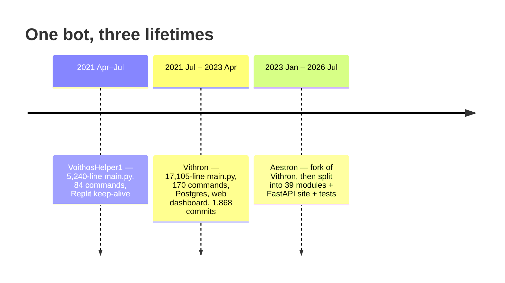
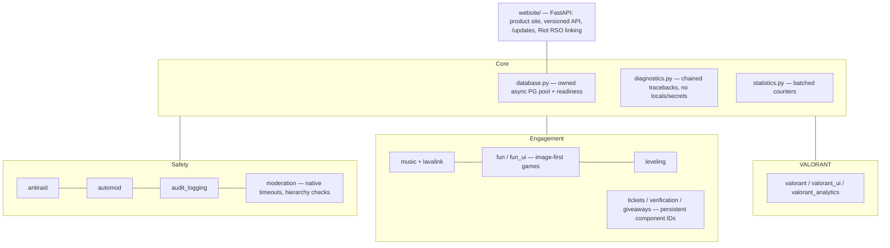

# Discord bots: VoithosHelper → Vithron → Aestron

One bot, three lifetimes, five years. It's the project where I learned async Python, Postgres,
OAuth, and what it means to keep a service alive for strangers — the habits that later ran the
Valorant Narrator backend.

| Bot | Active | Repo | Size | Shape |
|---|---|---|---|---|
| **VoithosHelper1** | 2021-04-11 → 2021-07-05 | [VoithosHelper1](https://github.com/JavaProgswing/VoithosHelper1) | 158 commits · 5,240-line `main.py` · 84 commands | single file on Replit |
| **Vithron** | 2021-07-05 → 2023-04-19 | private (+ public setup copy *VithronOPS*) | 1,868 commits · 17,105-line `main.py` · 170 commands | single file on Heroku + Postgres |
| **Vithron dashboard** | 2021-07-29 → 2022-01-15 | [vithron_webdashboard](https://github.com/JavaProgswing/vithron_webdashboard) | 848 lines | Quart + Discord OAuth2 |
| **Aestron** | 2023-01-13 → 2026-07-17 | [Aestron](https://github.com/JavaProgswing/Aestron) | 200 commits · 3,822-line `main.py` + 39 modules (~16.8k lines) + 1.3k-line website | package + FastAPI site + tests |

The hand-offs are literal: VoithosHelper1's last commit and Vithron's first are the **same day**
(2021-07-05), and Aestron's first commit is a 15,975-line copy of Vithron's `main.py`.

---

## Gen 1 — VoithosHelper1 (Apr → Jul 2021)

The first thing I shipped that other people used. One file, kept alive on Replit with the
classic Flask `keep_alive()` ping trick, and a dependency list that reads like "every free API I
found that month":

| Area | How |
|---|---|
| Slash commands | `discord_slash` (third-party, before discord.py had them natively) |
| Toxicity checks | Google **Perspective API** via `googleapiclient.discovery` |
| Member verification | `captcha` image challenges |
| Music | `youtube_dl` + `youtubesearchpython` |
| Minecraft | `mcstatus` server pings |
| Misc | `translate`, `googlesearch`, `psutil` stats, top.gg via `dbl` |
| Chat replies | a hand-written `long_responses.py` keyword table |

What it taught me: the event loop, rate limits, and that "keep a free host awake with a ping" is a
hack you eventually pay for. All state lived in globals.

## Gen 2 — Vithron (Jul 2021 → Apr 2023)

The "do everything" bot, and by far the most-worked-on codebase I have: **1,868 commits** in under
two years. Still one file — 17,105 lines and 170 commands — but now backed by an **asyncpg pool on
Postgres** and deployed on **Heroku** (`Procfile`).

Features, grouped by the tables that backed them:

| Feature | Tables |
|---|---|
| Per-guild config | `prefixes`, `commandguildstatus` (turn individual commands off per server) |
| Safety | `antiraid`, `cautionraid`, `spamchannels`, `linkchannels`, `profanechannels`, `blacklistedusers` |
| Timed punishments that survive restarts | `mutedusers`, `pendingunmute`, `pendingunblacklist` |
| Logging | `logchannels`, `logging`, `snipelog` |
| Leveling | `leveling`, `levelsettings`, `levelconfig`, `leaderboard` |
| Custom commands | `customcommands` |
| Verification | `verifychannels` (captcha) |
| Minecraft-themed economy | `mceconomy` — the single most-queried table |
| Private DM calls | `callsettings` |
| Valorant | `riotaccount`, `riotmatches` |

A few pieces I'm still happy with:

- **A real calculator, not `eval`.** A **PLY** (lex/yacc) grammar with `+ - * / ( )`, numbers, and
  `NAME = expr` assignment, so users get variables and nobody gets code execution. Aestron still
  has this as `calculator.py`, with its own tests.
- **Official Riot API, not scraping.** Valorant stats used a Riot developer key plus **RSO**, with
  background tasks (`valorantSeasonCheck`, `valorantMatchSave`) storing matches, and static JSON
  for agents, maps and weapons.
- **Wavelink (Lavalink) music** with Spotify metadata via `spotipy`, plus Discord Together
  activities, a code runner (JDoodle via `pydoodle`), translation with language detection, and
  paste uploads (`mystbin`).

### The dashboard (Jul 2021 → Jan 2022)

[vithron_webdashboard](https://github.com/JavaProgswing/vithron_webdashboard) is an 848-line
**Quart** app using `quart_discord` for Discord OAuth2 login and `quart_rate_limiter`, with
per-guild pages for music, moderation, commands and prefixes. It also served `riot.txt` for Riot
developer-app verification.

What Vithron taught me, mostly the hard way:

- **One file doesn't scale.** VithronOPS's setup README literally says "edit the owner IDs on line
  76" and "change the channel IDs on line 2429". You can feel that smell.
- **Config belongs in the environment.** Keys moved into `.env`, a habit every later project kept.
- **Persist anything with a timer.** A mute that ends "in 2 hours" has to survive a redeploy,
  hence the `pending*` tables.
- **State-changing actions belong behind POST + CSRF protection.** The dashboard's
  kick/ban/mute routes were GETs with the target in the path. Fine for 2021 me; never again.

## Gen 3 — Aestron (Jan 2023 → Jul 2026)

Aestron started as a copy of Vithron and **stayed a monolith for three years**. `main.py` sat
between 14,600 and 17,400 lines until 2024. The structural fix landed in one push in July 2026:

| Snapshot | `main.py` | Modules in `aestron_bot/` |
|---|---|---|
| 2023-01-13 (first commit) | 15,975 | 0 |
| 2024-02-17 | 16,084 | 0 |
| 2026-07-15 — *"refactor codebase, modularization and Moderation/Utility/Music rework"* | 9,654 | 14 |
| 2026-07-17 | **3,822** | **39** |

Today it targets **Python 3.12, discord.py 2.7, Wavelink 3.5, Lavalink 4**. The biggest modules:
`music` (1,231 lines), `valorant_ui` (953), `fun` (949), `tickets` (925), `verification` (904),
`automod` (884), `valorant` (878), `audit_logging` (748), `moderation` (670).

Decisions that mattered:

- **Persistent component IDs.** Ticket, verification and giveaway panels register stable
  `custom_id`s, so their buttons keep working after a restart. No re-posting panels, no dead
  buttons.
- **No module-level DB globals.** `database.py` owns the pool's lifecycle and readiness checks.
  Commands ask for the pool instead of importing a shared `conn`, which is the single biggest
  difference from Vithron.
- **Native Discord primitives.** Moderation uses real timeouts and role-hierarchy checks instead of
  a home-grown "Muted" role.
- **Diagnostics without leaks.** Error reports format chained tracebacks but never capture local
  variables, the opposite of the old habit of dumping everything into a log channel.
- **Linking that holds up.** The website's Riot RSO flow uses an **HMAC-signed, expiring OAuth
  `state` bound to the Discord user**, checked with `hmac.compare_digest` and a 10-minute max age,
  plus separate service and admin tokens for internal endpoints. Compare that with the 2021
  dashboard's GET-based ban routes.
- **Tests exist.** `tests/` covers the calculator, command docs, database, moderation, music,
  Perspective, fun, guild operations and deploy start-up.
- **A product site.** `/updates` shows recent changes, the running version, uptime, and a link to
  the exact deployed commit.

## Friends' bots and forks

- **Analytics-Bot** (Raj Dave's repo; 9 of the commits are mine): a py-cord bot with activity
  tracking, leaderboards and admin cogs. My first time working in someone else's cog layout.
- Forks I studied or patched: **TJ-Bot** (Together Java's community bot), **discord.py**,
  **Wavelink**.

---

## The thread through all three

Every rewrite was really about **state**: where it lives, who owns it, and whether it survives a
restart.

| | Where state lived | What a restart cost |
|---|---|---|
| VoithosHelper1 | Python globals | everything |
| Vithron | one file + Postgres | in-memory caches, tasks re-armed by hand |
| Aestron | owned modules + a managed pool + persistent components | nothing users notice |
