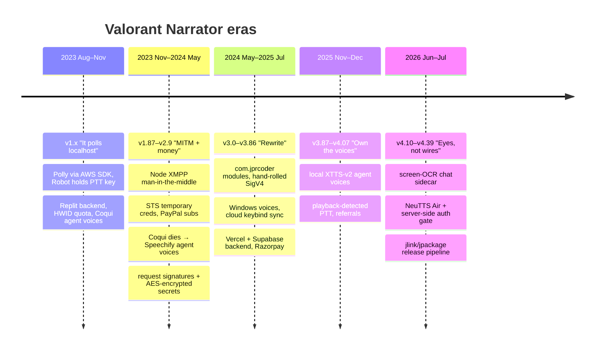

# 1 · Version history

Dates come from the commit history of the app repo. Version numbers are the app's own
(`currentVersion` in `Main.java`, later `<version>` in `pom.xml`). I've grouped them into eras,
because the interesting story is never one release — it is *why the architecture had to change*.

---

## Era 1 — v1.x: "it polls localhost" (Aug → Nov 2023)

| Version | Date | What changed |
|---|---|---|
| **1.3** | 2023-08-20 | First committed version. Reads the Riot Client `lockfile`, polls `GET /chat/v6/messages` on the local API **every 100 ms**, diffs against the messages it has already seen, and speaks new ones with **AWS Polly (neural, Matthew)** via the AWS SDK. A `java.awt.Robot` holds **Insert** (the PTT key) every 500 ms while the MP3 plays. Free tier = daily message quota tied to a hardware ID; backend on **Replit**. 13 hard-coded short forms (`GGWP`, `MB`, `NT`…). |
| 1.6 | 2023-08-28 | Big controller rework, console vs debug logging profiles. |
| **1.7 – 1.72** | 2023-09-10 → 09-11 | **First agent voices**: the client called **Coqui Studio**'s sample API directly with cloned agent voices and played the WAV. A short chime marks messages cut off at 71 characters. Command-line args (`win-launch`). |
| 1.74 – 1.79 | 2023-09-16 → 09-18 | GUI pass, **Polly voice list** incl. Indian-English *Kajal*, agent-voice and team/party source fixes, power-button and premium-warning fixes. |
| **1.8 / 1.8.1** | 2023-09-18 | **Auto-update**: the app asks the backend for the latest version and silently runs the new installer. Polly engine = *neural* for premium, *standard* for free. |
| 1.83 | 2023-10-04 | **Custom PTT keybind** (default moved to *End*, saved in `%APPDATA%\ValorantNarrator\config.json`). Polling replaced by the Riot Client's **local WebSocket** (`[5, "OnJsonApiEvent_chat_v6_messages"]` subscription) — push instead of poll, de-duplicated by message id. |
| 1.84 | 2023-10-09 | More short forms. |
| **1.85 – 1.86** | 2023-10-18 | **Agent voices moved behind the backend** ("AUTH" fix): the Coqui key left the client; the app now POSTs `{name, text, emotion, speed}` to `/getPremiumVoice`, which checks premium and proxies Coqui. Team-voice toggle. |
| — | 2023-10-21 | "MODULAR REWORK — SAVE" checkpoint (the rework landed properly in v3.0). |

**Why it changed:** the local chat API was great for party chat and whispers but in-game *team/all*
chat — the thing people actually wanted narrated — wasn't reliably exposed there. That pushed
everything toward intercepting the chat protocol itself.

## Era 2 — v1.87 → v2.9: "MITM + money" (Nov 2023 → Apr 2024)

| Version | Date | What changed |
|---|---|---|
| **1.87** | 2023-11-19 | **XMPP with Node.js.** A bundled Node script starts a fake *client-config* server and a TLS server, then launches the Riot Client with `--client-config-url` pointing at it, so the game's chat connection goes **through the app** (details in [02](02-reading-the-chat.md)). Same release: **"security fixes"** — the app no longer talks to Polly with credentials from the environment; the backend now hands out **15-minute STS credentials** per user in response headers. |
| 1.89 | 2023-11-22 | Parse `ares-coregame` MUCs → **team vs all chat**, `ares-parties` → party, `ares-pregame` → agent select. "More options" (per-channel toggles). |
| 1.9 | 2023-11-28 | *Kajal* neural voice opened up to standard users; prompt toggles. |
| **2.0** | 2023-12-23 | **Agent voices removed** — Coqui was winding down its hosted Studio, so the UI section was cut. |
| **2.1** | 2024-01-12 | **"API changes"**: backend moved off `*.repl.co` to its own domain (`api.valnarrator.tech`); PayPal subscription service moved to `replit.app`. |
| 2.2 – 2.3 | 2024-02-03 | Bug + voice fixes. |
| **2.4** | 2024-02-06 | **Agent voices are back — now via Speechify.** Playback switched from WAV `Clip` to streaming MP3 from a URL with JLayer (retrospective in the [README](README.md#the-speechify-era-in-retrospect-feb-2024--nov-2025)). |
| **2.5** | 2024-03-05 | **Registration.** First launch registers the install with the backend; per-install data is stored locally encrypted, and API calls are signed. |
| 2.6 – 2.7 | 2024-03-08 → 03-22 | Refactor; "urgent" encryption/registration fixes; **single-instance lockfile**. |
| 2.8 – 2.9 | 2024-03-31 → 04-26 | Bug fixes. Packaging was still **launch4j** wrapping a shaded jar + bundled JDK 17, installed by **Inno Setup**. |

**Why it changed:** v2.x was a pile of features on a codebase that started as one file. Package
names were still `com.example.*`, the AWS SDK alone was a big chunk of the installer, and
everything was a static singleton poking JavaFX controls.

## Era 3 — v3.0 → v3.86: the rewrite (May 2024 → Jul 2025)

| Version | Date | What changed |
|---|---|---|
| **3.0** | 2024-05-18 | **Rewrite.** `com.example` → `com.jprcoder.*` split into `valnarratorbackend`, `valnarratorencryption`, `valnarratorgui`; JPMS `module-info.java`. **AWS SDK dropped** — Polly is called with a hand-written **SigV4 signer** and the STS creds. **Windows built-in voices** via a persistent PowerShell `System.Speech` host. **Player names** resolved through Riot's name-service (PUUID → `name#tag`) so you can **ignore** specific players. **Valorant settings sync**: the app rewrites your cloud keybinds so its PTT key is bound to *Team Voice*, and points Valorant's mic at the virtual cable. The Node XMPP proxy is now a compiled `valorantNarrator-xmpp.exe`. App kills/relaunches Riot Client + Valorant through the proxy and exits when the game closes. |
| 3.1 – 3.4 | 2024-06-13 → 07-23 | Player-ignore fixes, **graceful exit on outdated versions** (backend returns 301/426 → modal + exit), pre-startup dialogs. |
| **3.5 – 3.7** | 2024-10-28 → 11-01 | Backend migrated to **Vercel (FastAPI) + Supabase**; app pointed at the new API. |
| **3.8 / 3.81** | 2024-11-03 | **Subscriptions** via the new payment service (PayPal + Razorpay), inbuilt-voice QoL. |
| 3.82 | 2025-01-19 | New agent **Tejo** (cloned on Speechify like the rest). |
| **3.83** | 2025-04-22 | **whisper.cpp speech-to-text experiment** (JNA bindings, live mic transcription) — added and removed the same day; JNA dropped from deps. |
| 3.84 – 3.86 | 2025-06-20 → 07-03 | TTS fix, HWID ("user serial") fixes, XMPP chat parsing improvements. |

## Era 4 — v3.87 → v4.07: own the voices (Nov → Dec 2025)

| Version | Date | What changed |
|---|---|---|
| 3.87 – 3.88 | 2025-11-10 → 11-14 | Refactor in two stages. |
| **3.90** | 2025-11-14 | **Local agent voices.** Speechify is gone; the app downloads and launches `valorantNarrator-agentVoices.exe` (an **XTTS-v2** server, published separately as *VoiceCloner*) and calls `POST 127.0.0.1:5005/speak`. **Playback detection**: instead of trusting the MP3 player's start/finish events, a `PlaybackDetector` listens to `CABLE Output`, learns the noise floor, and holds PTT exactly while there is real signal. |
| **4.00 – 4.01** | 2025-11-22 → 11-23 | Mouse-button keybinds, UI overhaul, agent-voice fixes. |
| 4.02 | 2025-11-24 | **Referrals** (both sides get premium time) + referral notifications. |
| 4.03 | 2025-12-03 | Voice fixes. |
| — | 2025-12-04 | A pure-**Java MITM** (config proxy + XMPP TLS relay with a generated keystore) committed and **reverted the same day**. |
| 4.06 – 4.07 | 2025-12-22 → 12-29 | Agent-voice OTA update logic (compare exe `FileVersion` against `agentvoicereleases`). |

## Era 5 — v4.10 → v4.39: eyes, not wires (Jun → Jul 2026)

| Version | Date | What changed |
|---|---|---|
| **4.10** | 2026-06-04 | **Screen-OCR chat.** The XMPP path stopped being viable (chat TLS pinned, game process protected by Vanguard). A C# sidecar now captures the chat box with `Windows.Graphics.Capture` and OCRs it; the Java side only needs the Riot local API to know *who you are*. **Full-forms manager** UI (user-editable short forms). Exit alert when Valorant closes. |
| 4.1x – 4.34 | 2026-06-05 → 06-06 | **Borderless prompt**: the sidecar notices exclusive-fullscreen (captures go black) and the app offers to switch Valorant to *Windowed Fullscreen*. Better exit detection, new agent voices, **restart after successful update**, tests. |
| 4.35 – 4.36 | 2026-07-16 → 07-17 | Narration rules, OCR fixes, "modular app" changes. |
| **4.37** | 2026-07-18 | **Premium agent-voice trial** (free users get a character budget) + in-app **"What's New"** recap pulled from the release row. Agent voices now come from **NeuTTS Air** (*AgentVoiceServer v2.x*), which **asks the backend to authorize every line** before synthesizing. |
| 4.38 – **4.39** | 2026-07-18 | Valorant auto-launch via the Start-menu shortcut (non-default install paths), VB-Cable endpoints force-unmuted at 100% on every start, borderless reliability. Built with **jlink + jpackage** into a native app-image, wrapped by Inno Setup, released through `release.ps1`. |

---

## Things that stayed constant

- **Java + JavaFX** for the app, from the first commit to the last.
- **The Riot Client lockfile** (`%LOCALAPPDATA%\Riot Games\Riot Client\Config\lockfile`, format
  `name:pid:port:password:protocol`) as the way to find and authenticate to the local API.
- **A held push-to-talk key** as the way audio gets onto team voice.
- **A backend-enforced daily quota for Polly** with premium bypass, reset at UTC midnight.
- **Short-form expansion** before speaking (`gg` is easier to hear as "good game").
