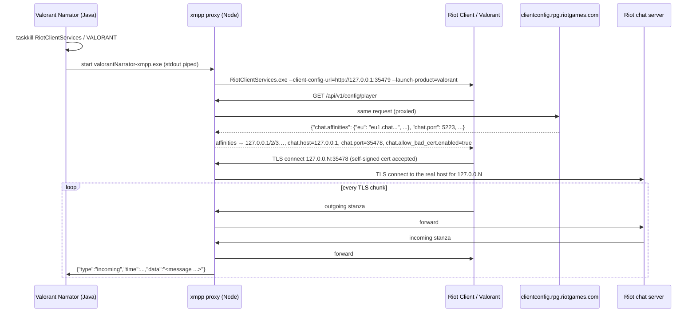

# 2 · Reading the chat

The whole product depends on one thing: **knowing, within a few hundred milliseconds, that someone
typed something in chat.** Valorant has no plugin API, so this part was rebuilt five times.

| Gen | Versions | Source | Latency | Channels | Why it ended |
|---|---|---|---|---|---|
| 1 | v1.3 – v1.82 | HTTP polling of the Riot Client local API | ≤100 ms + request | party, whispers, some group chat | wasteful, diff-based, not reliable for in-game chat |
| 2 | v1.83 – v1.86 | Local API **WebSocket** event subscription | push | party, whispers | still not the in-game team/all chat I needed |
| 3 | v1.87 – v4.07 | **XMPP man-in-the-middle** (Node, later a compiled exe) | push, ~0 ms | everything incl. team/all | needs the Riot Client to trust *my* chat server; stopped being viable |
| 3b | Dec 2025 | Java port of the MITM | — | — | never shipped (reverted same day) |
| 4 | v4.10 – now | **Screen OCR** sidecar (C#, WinRT) | ~50 ms frame + OCR | team, all, party, whisper | current |

---

## Shared groundwork: the lockfile

When the Riot Client runs it hosts a local HTTPS + WebSocket API and writes its coordinates to:

```
%LOCALAPPDATA%\Riot Games\Riot Client\Config\lockfile
name:pid:port:password:protocol
```

Every generation uses it. Authentication is HTTP Basic with user `riot` and the lockfile password:

```java
String[] data = lockfileText.split(":");          // name:pid:port:password:protocol
String base   = "https://127.0.0.1:" + data[2];
String auth   = "Basic " + Base64.getEncoder().encodeToString(("riot:" + data[3]).getBytes());
```

Two annoyances never went away:

- The local API uses a **self-signed certificate that isn't issued for `127.0.0.1`**. A trust-all
  `TrustManager` gets past the chain check, but Java's `HttpClient` *still* does hostname
  verification, and the only switch for that is the system property
  `jdk.internal.httpclient.disableHostnameVerification=true` (its `SSLParameters` are ignored for
  this). The current `RiotLocalApiClient` sets it in a static initializer and limits the client to
  loopback.
- Some responses embed JSON **as a string** inside JSON. v1.3 "fixed" that with
  `resp.replace("\"{", "{").replace("}\"", "}").replace("\\\"", "\"")`. Yes, really.

Identity comes from `GET /rso-auth/v1/authorization/userinfo` (game name + tag),
`/entitlements/v1/token` (access token + entitlements JWT, used later for Riot's name-service and
player-preferences APIs) and `/product-session/v1/external-sessions` (client version, PUUID via
`-subject=`, shard via `-ares-deployment=`). Good reference for all of these:
[valapidocs.techchrism.me](https://valapidocs.techchrism.me/).

---

## Gen 1 — polling (v1.3)

```java
CompletableFuture.runAsync(() -> {
    while (true) {
        ArrayList<Message> messages = fetchMessages();       // GET /chat/v6/messages
        for (Message m : filter(messages)) {
            if (!oldMessages.contains(m)) {                   // equals() = (mid, type)
                Polly.getInstance().speakVoice(expandShortForms(m.getBody()));
                oldMessages.add(m);
            }
        }
        Thread.sleep(100);
    }
});
```

Ten requests a second, an ever-growing `ArrayList` for de-duplication (`contains` is O(n)), and
filtering done by comparing `game_name#tag` strings. It worked, which is the best thing you can say
about it.

## Gen 2 — the local WebSocket (v1.83)

The same local server speaks a WAMP-flavoured WebSocket protocol. Opcode `5` subscribes to an
event; updates arrive as opcode `8` frames:

```text
→ [5, "OnJsonApiEvent_chat_v6_messages"]
← [8, "OnJsonApiEvent_chat_v6_messages", {"uri": "/chat/v6/messages/ares-parties",
                                          "data": {"messages": [{"mid": "...", "body": "...",
                                          "game_name": "...", "game_tag": "...", "type": "groupchat",
                                          "read": true}]}}]
```

Push instead of poll, de-dupe by `mid` in a `HashSet`. Message type came from the URI
(`/ares-parties` → party) and `type` (`chat` → DM). Better — but what people wanted narrated was
**in-game team chat**, and that's where this approach fell short for me.

---

## Gen 3 — becoming the chat server (v1.87 → v4.07)

Riot chat is **XMPP over TLS**. The Riot Client learns *which* chat server to connect to from its
**client-config** service, and the client accepts a launch flag that overrides where that config
comes from. That's the whole trick. The structure follows the approach popularised by tools like
*Deceive* (appear-offline) and techchrism's *valorant-xmpp-logger*.



### The config proxy (`ConfigMITM`)

An HTTP server on `127.0.0.1:35479` forwards **every** request to the real config service, except
that the response to `/api/v1/config/player` is rewritten:

```js
for (const [region, ip] of Object.entries(data['chat.affinities'])) {
    // one loopback alias per real chat host, so the TLS side knows where to forward
    mapping = { localHost: `127.0.0.${++id}`, riotHost: ip, riotPort: data['chat.port'] };
    data['chat.affinities'][region] = mapping.localHost;
}
data['chat.port'] = 35478;
data['chat.host'] = '127.0.0.1';
data['chat.allow_bad_cert.enabled'] = true;   // the client's own escape hatch
```

The `127.0.0.N` trick matters: Windows routes the whole `127.0.0.0/8` to loopback, so the TLS
server can read `socket.localAddress` to learn *which* real chat server the client meant.

### The TLS relay (`XmppMITM`)

A `node:tls` server with a self-signed cert accepts the client, opens a real TLS connection to the
mapped Riot host, buffers anything sent before the upstream is ready, and pipes bytes both ways.
Every chunk is also printed as one JSON line on stdout:

```json
{"type":"open-valorant","host":"<riot chat host>","port":5223,"socketID":1}
{"type":"incoming","time":1700000000000,"data":"<message from='abcd@ares-coregame.ap.pvp.net/...' type='groupchat'><body>rotate b</body></message>"}
{"type":"close-riot","socketID":1}
```

It also listened on **stdin** and wrote whatever it received to the Riot socket — the plumbing
for sending messages was there, it just never became a feature.

### The Java side

The app launches the proxy, reads stdout line by line and:

- learns **its own JID** from the bind response (`id='_xmpp_bind1'` → `<jid>puuid@...</jid>`);
- flips the loading UI to "Valorant opened" when it sees `_xmpp_session1`;
- for every incoming `<message`, extracts `from`, `type`, `jid`, `<body>` with regexes and
  HTML-unescapes the body (there was a 5,600-line `HtmlEscape.java` for that);
- maps the MUC domain to a channel:

| `from` domain | Channel |
|---|---|
| `ares-parties` | Party |
| `ares-pregame` | Team (agent select) |
| `ares-coregame`, room id ending in `all` | All |
| `ares-coregame`, otherwise | Team |
| anything with `type='chat'` | Whisper |

- exits the app 5 s after `close-riot` / `close-valorant`.

### What was fragile

- **The Riot Client had to be started by me.** The override only works at launch, so the app
  killed `RiotClientServices.exe` and `VALORANT-Win64-Shipping.exe` on startup and relaunched
  them through the proxy. Users hated that the game closed when the app opened.
- **Finding the client** went through the registry uninstall string
  (`HKCU\...\Uninstall\Riot Game valorant.live`), which breaks on non-default installs. Later
  versions resolve the Start-menu shortcut instead.
- **Regex on TLS chunks.** A stanza can be split across TLS records. Most of the time a chat
  message fits in one chunk; when it doesn't, you lose it.
- **The Java port that never was.** I tried twice to drop Node and do this in Java. The first
  time (Vert.x) the proxy worked when I hit it manually, but the Riot Client silently refused to
  use it while it happily used the Node version. The second attempt (Dec 2025, a `MitmService`
  with a generated keystore) was committed and reverted the same afternoon.

Eventually the path closed for good: chat TLS got pinned and the game process sits behind
Vanguard, so "be the chat server" stopped being an option.

---

## Gen 4 — reading the screen (v4.10 → now)

If the network won't tell you, the pixels will. `valorantNarrator-ocr.exe` is a ~550-line C#
(.NET 9, single-file, self-contained) sidecar. It needs nothing from the game process — it reads
the window like any screen recorder would.

```mermaid
flowchart TD
    A[Find VALORANT window] --> B[Capture frame<br/>Windows.Graphics.Capture<br/>PrintWindow fallback]
    B --> C{mostly black for ~5 s?}
    C -- yes --> W["stderr: {type:display, mode:fullscreen}<br/>→ app offers Borderless"]
    C -- no --> D[Crop bottom-left 45%×45%<br/>by window fractions, upscale ×3]
    D --> E{MD5 same as last frame<br/>and nothing pending?}
    E -- yes --> B
    E -- no --> F[Windows.Media.Ocr en-US]
    F --> G[Sort lines top→bottom<br/>re-join wrapped / split lines]
    G --> H[Parse '(Team) Name: body'<br/>drop input bar + HUD]
    H --> I{bulk view change?<br/>&lt;50% overlap with last frame}
    I -- yes --> R[re-seed silently]
    I -- no --> J[find anchor = last narrated line<br/>fuzzy, bottom-up]
    J --> K[emit lines below anchor<br/>newest only once stable for 2 frames]
    K --> L["stdout: {type:chat, channel, name, body, direction}"]
```

The interesting engineering is all in *not* re-narrating things, because OCR of a live,
semi-transparent, fading chat box is noisy:

- **Regex with required parens.** `^[(\[](Team|All|Party|Whisper)[)\]] (To|From)? Name: body$`.
  Requiring the brackets drops the unsent input bar (`Party: hello`) and HUD text
  (`PARTY CLOSED`) for free.
- **Split/wrapped lines are re-joined.** A `(Party) Name:` header with no body, or a long body that
  wrapped, absorbs up to 2 following lines — but never one that starts with a channel word.
- **Anchor, not set.** The sidecar remembers the *last line it narrated* and, each frame, finds it
  again with a **Levenshtein-budgeted fuzzy match** (OCR reads `test 11` as `testll`, `O` as `0`).
  Everything below the anchor is new, in order — so a burst of three messages is spoken in order.
- **Anchor lost?** (spam scrolled it away) → speak every visible line not in the recent-200
  fuzzy window.
- **Stability gate.** The newest line must read identically for 2 frames (capped at ~0.75 s) so a
  message that's still fading in is spoken once, as its settled text.
- **Bulk view change.** If a frame shares less than half its lines with the previous one (tab
  switch, chat expanding because you started typing, big scroll), everything is re-seeded
  silently. This was the fix for "it repeats everything when I open whispers".
- **Startup grace.** For the first 3.5 s everything visible is seeded, so restarting mid-match
  doesn't re-read the backlog.
- **Idle is free.** Frames whose crop hashes the same as the last one skip OCR entirely.
- **Noise floor.** Bodies with fewer than two letters (a lone `,` off a fading line) are dropped;
  real chat — even `gg` — always has two.

Everything is tunable through env vars (`VN_OCR_RX/RY/RW/RH`, `VN_OCR_FPS`, `VN_OCR_STABLE`,
`VN_OCR_WRAP`, `VN_OCR_DEBUG`…) and there's a `selftest` mode for the parser.

### The Java side of OCR

`OcrChatClient` launches the sidecar, turns each stdout line into a `Message`, and restarts the
process with exponential back-off (1 s → 30 s, reset after 5 s of healthy uptime) so chat can't go
silently dead mid-match. **Own-message detection** compares the OCR'd sender with your Riot name,
allowing **one character edit** for names of 5+ characters — otherwise a single misread letter
in your own name re-routes your message to a channel you disabled and it gets dropped. For
whispers, the `To`/`From` prefix overrides the name check.

Stderr carries diagnostics (`ocr-ready`, `capture: wgc|printwindow`, `waiting`, `display`). The
`display: fullscreen` signal exists because **Windows.Graphics.Capture can't see an
exclusive-fullscreen window** — the app catches it and offers to flip Valorant to *Windowed
Fullscreen* (which also fixes stutter).

### Trade-offs

| | XMPP MITM | OCR |
|---|---|---|
| Accuracy | exact text | OCR errors, mitigated by fuzzy matching |
| Latency | instant | ~one frame (50 ms) + OCR time |
| Setup cost | kill & relaunch Riot Client | must run borderless |
| Robustness to Riot changes | broke whenever chat/config changed | breaks only if the chat UI moves |
| Needs to touch the game? | yes (its network config) | no |
| Identical consecutive messages | distinct | collapse into one (OCR can't tell copies apart) |
