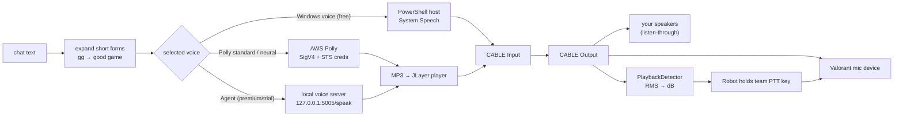

# 3 · Voice & audio pipeline

Two separate problems hide in "make chat speak":

1. **Synthesis** — turn `mb rotating b` into audio, in some voice, fast.
2. **Transmission** — get that audio onto Valorant's *team voice channel*, which only accepts audio
   from a microphone while a push-to-talk key is held.

The second one turned out to be harder.



---

## Synthesis

### Short forms first

Before anything is spoken, the body is cleaned (`/` and `\` stripped) and run through a
**short-form table** with case-insensitive word-boundary regexes:

```java
message = message.replaceAll("(?i)\\bGGWP\\b", "Good game,,,well played!");
message = message.replaceAll("(?i)\\bMB\\b",   "My bad!");
message = message.replaceAll("(?i)\\bNT\\b",   "Nice Try!");
```

v1.3 had 13 hard-coded entries (the `,,,` is a poor man's pause). Since v4.10 the table lives in
`config.json` under `fullForms` and is editable from a *Full forms* manager in the UI.

### AWS Polly — three generations of credentials

| Versions | How the app called Polly | Credentials |
|---|---|---|
| v1.3 – v1.86 | AWS SDK v2 `PollyClient` (`ap-south-1`), `SynthesizeSpeechRequest` → MP3 | from environment variables |
| v1.87 – v2.9 | AWS SDK v2, `StaticCredentialsProvider` | **15-minute STS credentials** issued per user by the backend |
| v3.0 – now | **No SDK.** `java.net.http` + a hand-written **SigV4** signer | same STS credentials |

Engine choice: **neural for premium, standard for free** (plus a couple of voices like *Kajal*
that are neural-only). Since v3.x the text is wrapped in SSML so users can change speed:

```json
{"Engine":"neural","OutputFormat":"mp3","TextType":"ssml","VoiceId":"Matthew",
 "Text":"<speak><prosody rate='110%'>rotating b</prosody></speak>"}
```

**Why hand-roll SigV4?** The AWS SDK brought its own HTTP stack and a long tail of jars into a
JPMS-modular, jlink-ed app — all for a single API call. Polly's `POST /v1/speech` is one JSON request, and SigV4 is four steps:

```text
1. Canonical request   = METHOD \n /v1/speech \n <query> \n <sorted lowercase headers> \n
                         <signed header names> \n SHA256(body)
2. String to sign      = "AWS4-HMAC-SHA256" \n <x-amz-date> \n <date>/<region>/polly/aws4_request \n
                         SHA256(canonical request)
3. Signing key         = HMAC(HMAC(HMAC(HMAC("AWS4"+secret, date), region), "polly"), "aws4_request")
4. Authorization       = "AWS4-HMAC-SHA256 Credential=<keyId>/<scope>, SignedHeaders=..., Signature=" +
                         hex(HMAC(signing key, string to sign))
```

The signed headers are `content-type`, `host`, `x-amz-content-sha256`, `x-amz-date` and
`x-amz-security-token` (the STS session token). A `VoiceTokenHandler` refreshes credentials every
**895 s** (just under STS's 900 s minimum lifetime). If Polly still returns **403**, the app logs how
long ago the last refresh was, refreshes synchronously and retries once.

How the backend mints those credentials is in [05-backend.md](05-backend.md#temporary-aws-credentials).

### Windows built-in voices (v3.0+, free & unlimited)

Spawning PowerShell (and re-loading `System.Speech`) per message is slow, so the app keeps **one
long-lived PowerShell process** and writes commands to its stdin:

```powershell
# once, at startup
Add-Type -AssemblyName System.Speech
$speak = New-Object System.Speech.Synthesis.SpeechSynthesizer
$speak.GetInstalledVoices() | Select-Object -ExpandProperty VoiceInfo |
    Select-Object -Property Name | ConvertTo-Csv -NoTypeInformation | Select-Object -Skip 1
echo 'END_OF_VOICES'

# per message
$speak.SelectVoice('Microsoft Zira Desktop'); $speak.Rate = 0; $speak.Speak('rotating b');
```

The voice list is read until the `END_OF_VOICES` sentinel. Rate maps from the app's 0–200 % slider
to SAPI's −10…+10 (`rate / 10 − 10`). Because this audio comes from the *PowerShell* process, not
Java, the app routes **that PID** to the virtual cable too (see below). A third-party helper script
(Apache-2.0, by Johann Loefflmann) was kept around to unlock the extra Windows voices for x64 apps
like PowerShell.

### Agent voices

Handled by a separate local server — see [04-agent-voices-and-cloning.md](04-agent-voices-and-cloning.md).
From the audio pipeline's point of view it's just another MP3 stream.

---

## Transmission: getting audio into the game

Valorant's team voice is push-to-talk from a microphone. So the app needs (a) a fake microphone
that carries its audio, and (b) a finger on the PTT key.

### The virtual cable

[VB-Audio Virtual Cable](https://vb-audio.com/Cable/) gives you a playback device (`CABLE Input`)
whose audio appears on a recording device (`CABLE Output`). The app shells out to NirSoft's
**SoundVolumeView** (shipped in the install dir) to wire it up — this has been in the app since
v1.3:

```bat
:: everything this process plays → the cable (Windows "App volume and device preferences")
SoundVolumeView.exe /SetAppDefault "CABLE Input" all <java pid>
:: …and the PowerShell host's pid, for Windows voices
SoundVolumeView.exe /SetAppDefault "CABLE Input" all <powershell pid>
:: so you hear it too: "Listen to this device" on CABLE Output → default speakers
SoundVolumeView.exe /SetPlaybackThroughDevice "CABLE Output" "Default Playback Device"
SoundVolumeView.exe /SetListenToThisDevice   "CABLE Output" 1
:: v4.38: Windows remembers per-device mute/volume — force both ends on, every start
SoundVolumeView.exe /Unmute "CABLE Input"  &  SoundVolumeView.exe /SetVolume "CABLE Input" 100
SoundVolumeView.exe /Unmute "CABLE Output" &  SoundVolumeView.exe /SetVolume "CABLE Output" 100
```

The **mic toggle** does the reverse for your real voice: "listen to" your default microphone
*through* `CABLE Input`, so when Valorant's mic is the cable you can still talk normally.

### Pointing Valorant at the cable — and binding the key (v3.0+)

In v1–v2 users had to do this by hand in Valorant's settings, which is where most support tickets
came from. v3.0 does it automatically, in two places:

**1. Cloud keybinds.** Valorant stores keybinds server-side as *player preferences*. With the
access token + entitlements from the local API:

```text
GET  https://player-preferences-<region>.pp.sgp.pvp.net/playerPref/v3/getPreference/Ares.PlayerSettings
→ {"data": "<base64( raw-deflate( JSON ) )>"}
```

The app base64-decodes, **raw-inflates** (zlib with `nowrap=true`), and edits the JSON:

- removes every `VOICE_TeamPTTAction` mapping, remembering your original primary key;
- adds the app's key at `bindIndex: 1` and puts your original key back at `bindIndex: 0`, so
  *both* work;
- drops the `EAresBoolSettingName::PushToTalkEnabled` override;

then deflates, base64-encodes and `PUT`s it back to `/playerPref/v3/savePreference`.

**2. Local capture device.** The voice input device is a *local* setting, in

```text
%LOCALAPPDATA%\VALORANT\Saved\Config\<puuid>-<shard>\Windows\RiotUserSettings.ini
```

The app asks SoundVolumeView for the cable's endpoint ID
(`/GetColumnValue "VB-Audio Virtual Cable\Device\CABLE Output\Capture" "Item ID"`), and writes
`EAresStringSettingName::VoiceDeviceCaptureHandle="{<id>}"`.

### Holding the key — three generations

| Versions | Strategy | Problem |
|---|---|---|
| v1.3 | `Robot.keyPress(Insert)` every 500 ms while JLayer plays, release when the player's `finished` flag flips | key spam; timing tied to the decoder, not the audio |
| v1.8x – v3.86 | One background loop that re-presses the bound key every 500 ms; later JLayer's `playbackStarted`/`playbackFinished` listener presses/releases | "finished" means *decoded*, not *heard* — audio still in the cable's buffer got cut; Windows voices have no such events at all |
| **v3.90+** | **PlaybackDetector**: press, start TTS, and release only when the *cable itself* goes quiet | — |

`PlaybackDetector` opens `CABLE Output` as a 48 kHz / 16-bit / mono `TargetDataLine` and, for every
256-byte chunk:

```java
double rms = sqrt(sum(sample²) / n) / 32768.0;
float  db  = 20 * log10(rms);                 // −90 dB floor
```

It calibrates on startup (1 s of silence → `threshold = noise peak + 4 dB`), keeps a 5-sample
rolling average and a 20 ms debounce. The narration flow is:

```java
pressKey();                       // open team mic
tts.run();                        // any engine: Polly, agent, Windows
waitForAudioToStart(3_000);       // detector sees signal on the cable
waitUntilDetectorSilent(30_000);  // hard cap so steady noise can't pin PTT open
releaseKey();                     // always, in finally
```

This made every engine behave the same — including Windows voices, which play from another
process and give Java no callbacks at all.

---

## The dictation experiment (v3.83, Apr 2025)

For one day the app shipped **whisper.cpp through JNA** (a vendored copy of the Java bindings plus
`AudioHandler` / `LiveSpeechToTextHandler`). Mic audio was cut into fixed chunks, and each chunk
was transcribed together with the **tail of the previous chunk** so words on a boundary weren't
lost:

```java
float[] previousTail = handler.getTailFromPrevious(samplesKeepLength);
float[] newAudio     = handler.getRecordedAudio();
float[] fullAudio    = concat(previousTail, newAudio);
callback.callback(transcriber.transcribeAudioAsFloats(fullAudio), fullAudio);
```

It was pulled the same day — commits *"Transcript removed"* and *"Remove JNA from deps."* A native
library plus a Whisper model on every user's machine is a heavy ask for an app whose pitch is
"no FPS drop". The standalone prototypes (`WhisperCPP`, `Vosk` speaker recognition) live on
outside the app.
