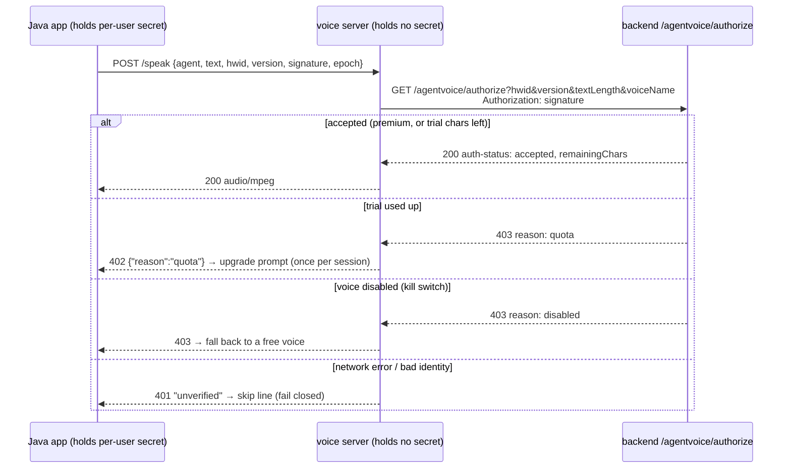

# 4 · Agent voices & voice cloning

"Make my teammate's callout sound like Sova" is the feature people paid for. It went through four
backends in three years, and the reasons each one died are a decent summary of the hosted-AI
landscape between 2023 and 2026.

| Era | Versions | Engine | Where it ran | Cost model | Ended because |
|---|---|---|---|---|---|
| 1 | v1.7 – v1.9 (Sep – Dec 2023) | **Coqui Studio** cloned voices (XTTS under the hood) | Coqui's cloud | paid API key | Coqui wound down its hosted service |
| 2 | v2.4 – v3.86 (Feb 2024 – Nov 2025) | **Speechify** voice cloning, driven by my backend | Speechify's cloud | consumer credits | fragile, unsustainable, not defensible — see the [README retrospective](README.md#the-speechify-era-in-retrospect-feb-2024--nov-2025) |
| 3 | v3.90 – v4.3x (Nov 2025 – Jul 2026) | **XTTS-v2** (Coqui TTS, open weights) | **user's PC**, `valorantNarrator-agentVoices.exe` | free after download | heavy model, slow on CPU |
| 4 | v4.37 – now (Jul 2026) | **NeuTTS Air** (GGUF via llama.cpp) + NeuCodec ONNX decoder | **user's PC** | free after download; trial gated by backend | — |

All four keep the same contract from the app's point of view: *give me an agent name and a line
of text, give me audio back.*

---

## Where the reference audio comes from

Every zero-shot cloner needs a few seconds of clean speech from the target. For Valorant agents
the obvious source is the in-game voice lines, which the community catalogues on the Valorant
Fandom wiki: each agent has a `/<Agent>/Quotes` page with `<audio>` elements next to the
transcript.

The first scraper (2024) did the minimum:

```python
agents = [a["displayName"] for a in
          requests.get("https://valorant-api.com/v1/agents?isPlayableCharacter=true").json()["data"]]
for name in agents:
    html  = requests.get(f"https://valorant.fandom.com/wiki/{name.replace('/', '')}/Quotes").text
    lines = parse_audio_buttons(html)                    # [{"text": ..., "audio_url": ...}]
    best  = max(lines, key=lambda l: len(l["text"]))     # longest line ≈ most speech
    download(best["audio_url"], f"AgentsVL/{name}.mp3")
```

v2 (Nov 2024) took the *N* longest lines and concatenated them with `pydub` for a longer
reference. The 2026 tooling builds a proper **transcript-aligned corpus** and *scores* lines,
because "longest" turned out to be a bad heuristic — the longest lines are often shouted
ultimates with effects on top:

```python
TACTICAL = ("spike", "site", "mid", "enemy", "opponent", "ult", "ultimate")
def score(agent, row):
    penalty  = 1000 * any(term in row.text.lower() for term in SPECIAL_EXCLUDES.get(agent, ()))
    penalty += 35 * sum(term in row.text.lower() for term in TACTICAL)   # combat barks
    penalty += abs(len(row.text) - 65) * 0.35                            # ~one sentence
    penalty += abs(row.duration - 2.4) * 5                               # ~2.4 s clips
    penalty += 0 if row.text.endswith((".", "!", "?")) else 8            # complete sentences
    return penalty
```

Candidates must be 0.8–5.5 s and 24–180 characters; the best-scoring unique lines are stacked up
to ~12–14 s (max 6 pieces). There are hand-written per-agent excludes too (Sage's "barrier
created", Omen's "look behind you"…) — lines that carry ability SFX or extreme delivery. Every
candidate set is auditioned before it's promoted to the production profile file.

> The corpus, the reference audio, and the resulting profiles are kept out of every public
> repo. They're Riot's voice actors' work; I only ever shipped derived model inputs inside the
> app, and treat even that as a grey area.

---

## Era 1 — Coqui Studio (2023)

Coqui Studio let you clone a voice from an upload and then call it by `voice_id`:

```http
POST https://app.coqui.ai/api/v2/samples?format=wav
Authorization: Bearer <key>
{"voice_id": "<cloned Sova>", "name": "Sova", "text": "rotating b", "emotion": "Neutral", "speed": 1}
```

In **v1.7** the *desktop app* made this call with a key from the environment. **v1.85** moved it
behind `/getPremiumVoice` so the key lived only on the server and the server could check premium
first. The response was a WAV the app played with `javax.sound.sampled.Clip`. When Coqui's hosted
product went away at the end of 2023, **v2.0** simply removed the agent voice section from the UI.

## Era 2 — Speechify (2024–2025)

Six weeks later agent voices were back, now generated by Speechify's consumer voice-cloning
product and called from my backend. It lasted ~21 months and was never a supported integration;
the short retrospective (and why it was replaced) is at the end of the
[README](README.md#the-speechify-era-in-retrospect-feb-2024--nov-2025).

---

## Era 3 — XTTS-v2 on the user's machine (Nov 2025)

v3.90 cut the cloud out entirely. The app downloads a separate executable
(`%LOCALAPPDATA%\ValorantNarrator\valorantNarrator-agentVoices.exe`), starts it, waits for
`Application startup complete` on its stdout, and talks to it over loopback:

```http
POST http://127.0.0.1:5005/speak
{"agent": "sova", "text": "rotating b"}
→ 200 audio/mpeg
```

The server is the public **[VoiceCloner](https://github.com/JavaProgswing/VoiceCloner)** project:
FastAPI + Coqui TTS's **XTTS-v2**, frozen with PyInstaller.

### How XTTS cloning works (the useful mental model)

XTTS doesn't fine-tune per voice. It conditions a single model on two things computed from the
reference audio:

- a **GPT conditioning latent** — captures prosody/style, fed to the autoregressive text→audio-token
  model;
- a **speaker embedding** — captures timbre, fed to the decoder that turns audio tokens into a
  waveform.

Computing those is the slow part, and it only depends on the reference audio. So VoiceCloner does
it **once per agent**, at build time:

1. **Clean the reference** with ffmpeg into up to 3 × 12 s segments:
   `highpass=f=80, lowpass=f=9000, silenceremove=…, loudnorm=I=-23:TP=-2:LRA=11`.
2. **Compute latents** with `get_conditioning_latents(...)`.
3. **Cache** them as `latent_cache/<agent>.<key>.pt` (`{"gpt_cond_latent", "speaker_embedding"}`),
   keyed by a fingerprint of the source file and the conditioning parameters.
4. **Bundle** the cache into the exe so a fresh install starts with every agent ready.

At request time it's just `model.inference(text, lang, gpt_cond_latent, speaker_embedding, …)` with
conservative sampling (temperature 0.65, top-p 0.80, top-k 50, repetition penalty 10) — higher
temperatures sound more "alive" but drift away from the speaker.

Device selection is automatic: it checks for CUDA, **free VRAM ≥ ~3 GB** and runs a tiny benchmark
before trusting the GPU; otherwise CPU. Short callouts take ~400–600 ms warm on a laptop RTX 3050
and several seconds on CPU. The CPU build is ~357 MB; a CUDA build is ~2.7 GB, which is over
GitHub's 2 GB release-asset limit, so large builds were distributed through Hugging Face.

### Shipping a Python model server inside a Java app

- **OTA updates.** The app reads the exe's Windows `FileVersion` (via PowerShell), compares
  `major.minor` against the newest row in the backend's `agentvoicereleases` table, and downloads
  a replacement if needed — independently of app updates.
- **Progress.** The server's stdout (tqdm bars, `[INFO]`, `[1/3]`-style lines) is pattern-matched
  and shown in the UI while models load.
- **The numba bug.** The frozen exe shipped a zeroed `numba` cache, which crashed `librosa`'s import
  with `_pickle.UnpicklingError: invalid load key, '\x00'`. Fix without re-releasing the exe: the
  Java launcher wipes and points `NUMBA_CACHE_DIR` at a fresh writable folder before starting it.
- **Single narration thread.** Connect timeout 3 s (it's loopback), read timeout 60 s (synthesis can
  be slow) — bounded so a hung server can't block narration forever.
- **JSON built with Gson**, not `String.format`, because chat contains quotes and backslashes.

## Era 4 — NeuTTS Air + a server-side gate (Jul 2026)

XTTS-v2 is a full PyTorch model that takes seconds per line on CPU — a poor fit for the low-end
laptops a lot of players are on. The current **AgentVoiceServer** (v2.x) swaps the engine for
**NeuTTS Air**, which runs through llama.cpp:

| Piece | What it is | Where it runs |
|---|---|---|
| Backbone | NeuTTS Air language model, **GGUF Q8** (Q4 optional "fast" mode) | `llama.cpp` (CPU, or GPU offload when the CUDA wheel is present) |
| Codec | **NeuCodec** decoder exported to **ONNX** | CPU |
| Phonemizer | eSpeak NG | bundled DLL |
| Voice profile | per-agent **reference codes** (NeuCodec tokens of the reference clip) + the **exact transcript** of that clip | `agent_refs.json` |

The idea is the same as XTTS's latents — precompute what describes the voice — but here the
"latent" is literally the reference audio already encoded into the codec's token space, plus its
text. Synthesis is `tts.infer(text, ref_codes, ref_text)`, then a tail trim (cut 80 ms after the
last sample above 2 % of peak, 30 ms fade) and an ffmpeg pipe to MP3.

Small robustness tricks that mattered:

- **Per-call reseed.** llama.cpp sampling can replay an identical bad path on retry. The server
  patches `create_completion` to `set_seed(random)` each call.
- **Retries with punctuation.** If synthesis returns nothing, retry with a trailing `.` added
  (models end sentences better when they *see* an ending), then plain retries — 3 attempts total.
- **One inference at a time** behind a lock; text capped at 300 characters.
- **onedir build** by default: a onefile PyInstaller exe re-extracts multi-GB models on every
  launch.

### The authorization gate

With XTTS, anyone could pull `valorantNarrator-agentVoices.exe` out of the install folder and use
it as a free, unlimited voice server. v2.1 of the voice server fixes that by putting the
**licensing check inside the voice server itself**:



- The **Java app** mints the signature (it has the secret); the voice server only forwards it, so
  the exe on its own can't authorize anything.
- The backend is the single source of truth for the **free trial** (500 characters by default,
  counted server-side in `userhwids.agentcharsused`, client-reported length clamped to 200 per
  request) and for a per-voice **kill switch** (`agentvoiceflags`, with `*` disabling all) used
  when a voice's quality regresses.
- Any doubt — timeout, TLS error, parse error — means **no audio**.
