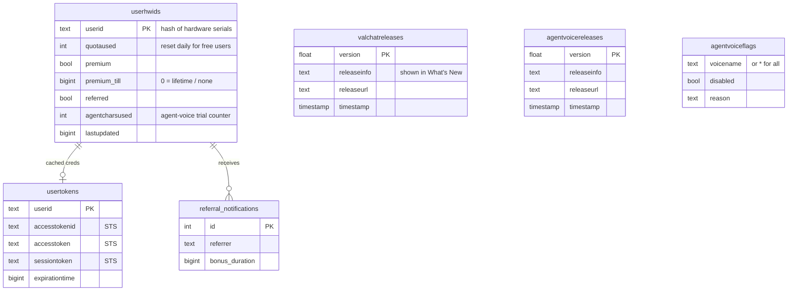
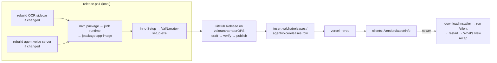

# 5 · Backend

The backend has one job description that never changed: **know who a user is, whether they're
premium, how much free quota they have left today, and hand them what they need to synthesize
speech without ever holding a long-lived secret.** It also serves updates and takes payments.

## Hosting eras

| Period | Where | Stack | Notes |
|---|---|---|---|
| Aug 2023 – Jan 2024 | **Replit** (`*.repl.co`) | Python, Quart + Hypercorn, asyncpg (Postgres), boto3 | Free tier, cold starts, URL changed when Replit changed domains |
| Jan 2024 – Oct 2024 | **Own domain** (`api.valnarrator.tech`) on a small VM | Quart + Hypercorn, asyncpg, **Redis-backed rate limiter** keyed by HWID | Request signatures and registration added here (v2.5) |
| Oct 2024 – now | **Vercel** serverless (`api-valnarrator-vercel`) | **FastAPI**, `supabase-py`, `slowapi` limiter on Redis, boto3 | Postgres moved to **Supabase**; separate Vercel apps for payments and the website |

Each move was practical: Replit retired its `*.repl.co` domains (the payment service had already
moved to `*.replit.app` in v2.1), and a VM needs babysitting. Vercel's Python runtime has a max
execution time, which is why
several Oct 2024 commits are literally titled "vercel-max-runtime fix" — anything slow (like
waiting on a third-party TTS) had to fit inside one request.

A periodic job (`valNarratorTasks`) reset free users' `quotaused` to 0 at **UTC midnight** and
cleaned up expired referral rows, posting a Discord webhook each time. Discord webhooks were the
whole monitoring story: errors from any endpoint were pushed to a private channel.

---

## Endpoints (current)

| Endpoint | Caller | Purpose |
|---|---|---|
| `GET /register` | app | First launch: create the row for this install |
| `GET /quotaLimit` | app | Today's free quota (e.g. 20 lines) |
| `GET /remainingQuota` | app | Remaining quota, `premium`, `premiumTill` |
| `GET /` | app | Consume one quota unit and return short-lived AWS credentials; `403` + `refreshesIn` when exhausted |
| `GET /agentvoice/authorize` | voice server | Gate for the local agent voice server: `accepted` / `rejected:quota` / `rejected:disabled` |
| `GET /refer` | app | Apply a referral code |
| `GET /referral/notifications` | app | Pending "someone used your code" notices (then deleted) |
| `GET /version/latest/info` | public | `{version, agent_version, changes, timestamp, agent_timestamp}` |
| `GET /installer/version/latest` | public | `302` to the newest installer on GitHub Releases |
| `GET /agentvoice/download` | public | `302` to the newest agent-voice exe |

Version gating happens in shared middleware: every app request carries its version, and anything below `REQUIRED_VERSION` gets **426 Upgrade Required**.
The app turns that into a "please update" dialog and exits — the only reliable way to retire old
clients with old bugs.

## Data model (Supabase / Postgres)



Premium expiry is **lazy**: there's no cron for it. Any endpoint that reads a user row checks
`premium_till < now` and flips `premium` off right there.

---

## Temporary AWS credentials

The single most important backend decision: **the desktop app never gets a long-lived AWS key.**

```python
policy = {"Version": "2012-10-17",
          "Statement": [{"Effect": "Allow", "Action": "polly:SynthesizeSpeech", "Resource": "*"}]}
creds = sts.assume_role(RoleArn=ROLE, RoleSessionName="temporary_session",
                        Policy=json.dumps(policy), DurationSeconds=900)["Credentials"]
```

- The role itself can only call Polly, and the **inline session policy** narrows the session to
  exactly `polly:SynthesizeSpeech` — even a leaked set can't touch anything else.
- **900 s** is the STS minimum. Credentials are cached per user in `usertokens` and re-minted only
  when within 10 s of expiry, so a burst of chat doesn't hit STS for every line.
- They're returned as response **headers** on `GET /` (the same call that consumes a quota unit),
  so "you may speak one more line" and "here's how" arrive together.
- The client signs Polly requests itself (SigV4 — see [03](03-voice-and-audio.md)), so audio goes
  straight from AWS to the user; the backend never proxies megabytes of MP3.

---

## Client identity

There are no user accounts. An install is identified by a hardware-derived ID and registers itself
with the backend on first launch. Why no accounts: zero-friction onboarding for a gaming utility
(no sign-up, no password resets) and a free tier tied to a machine rather than to an email you can
regenerate.

---

## Payments

| Period | Provider | Flow |
|---|---|---|
| 2023 – 2024 | **PayPal Subscriptions** | The app calls `/createSubscription` on the payment service, which creates a PayPal subscription with **`custom_id = HWID`** and returns the approval link. PayPal's webhook (`BILLING.SUBSCRIPTION.ACTIVATED`, `PAYMENT.CAPTURE.COMPLETED`) comes back with that `custom_id`, and the service sets `premium` / `premium_till` on the matching row. |
| Oct 2024 – now | **PayPal + Razorpay** (`payment-valnarrator-vercel`) | Razorpay added for Indian users (INR). One-time orders are created server-side for both providers (`/razorpay/createPayment`, `/paypal/createPayment`); Razorpay success is accepted only after `verify_payment_signature(...)` plus a server-side fetch of the payment, and both providers have webhooks that also handle **refunds/reversals** (`PAYMENT.CAPTURE.REFUNDED` / `REVERSED`) by revoking premium. |

Putting the HWID into the provider's `custom_id` meant no account linking at all: whatever machine
started checkout is the one that becomes premium.

## Referrals (v4.02)

`/refer?hwid=<you>&referrer=<friend>` gives the **referrer +3 days** of premium (stacked onto any
existing premium) and the **new user +1 day**, resets the new user's quota, marks them `referred`
(once per install), and drops a row into `referral_notifications`. The referrer's app polls
`/referral/notifications`, shows a toast, and the rows are deleted. Durations are env vars
(`REFERRAL_DURATION=259200`, `REFERRAL_SELF_DURATION=86400`).

---

## Updates & the release pipeline



- **App updates.** On start the app compares its version with `/version/latest/info`; if older, it
  follows `/installer/version/latest` (a 302 to the GitHub release asset), downloads to `%TEMP%`,
  runs the Inno Setup installer with `/silent`, and restarts. Since v4.37 the first launch after an
  update shows the `releaseinfo` text as a *What's New* dialog (state kept in `whatsnew.json`).
- **Agent-voice updates** are separate: the exe's Windows `FileVersion` major.minor vs
  `agent_version`, replaced in place (only the launcher exe; the multi-GB `_internal\` folder stays).
- **Packaging history.** 2023–24: a shaded fat jar wrapped by **launch4j** with a bundled JDK 17.
  2026: a **jlink**-ed runtime + **jpackage** `app-image` (native launcher with proper
  `FileVersion`/`CompanyName` resources), staged into the Inno Setup payload.
- The release checklist is deliberately manual for the steps that need judgement: version bumps,
  release notes, and database writes.
