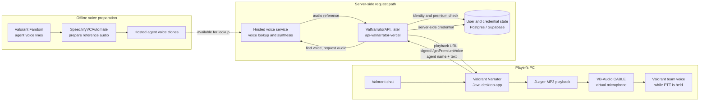
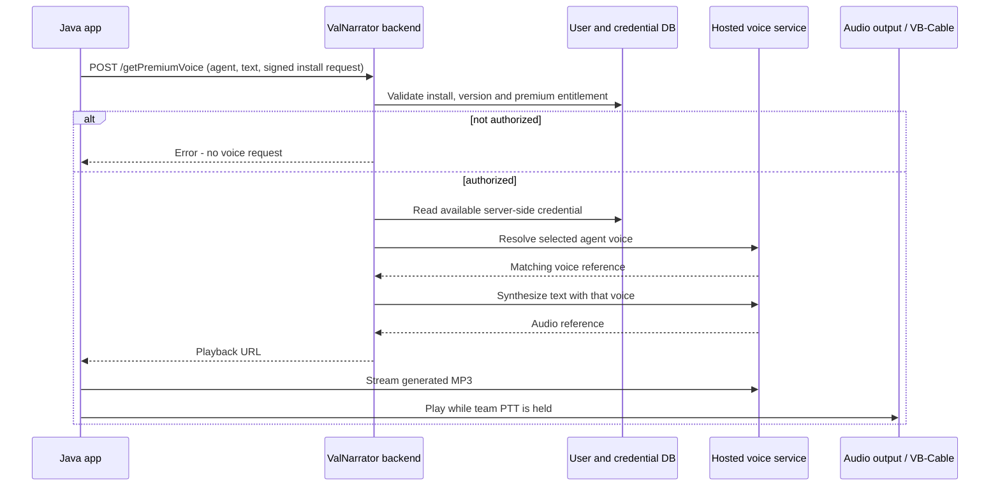

# 7 · How the Speechify-backed agent voices worked

This chapter documents Valorant Narrator's historical agent-voice path from **v2.4 (Feb 2024)** through the **v3.88–v3.90 local-model migration (Nov 2025)**. The app kept its `/getPremiumVoice` contract from the earlier Coqui era while the service behind that contract changed. See [01](01-version-history.md) for the release timeline, [04](04-agent-voices-and-cloning.md) for voice-engine history, and [06](06-speechify-era.md) for the retrospective.

The app and backend repositories named here are private. Commit IDs help collaborators with access verify the history. This is an architecture map, not a guide to operating the retired consumer-service integration. It excludes credentials, account details, and token values.

---

## The system in one picture

**Preparation** created the agent voices. **Runtime** generated one line for an authorized player request. The two paths shared the hosted voice inventory, but preparation did not run for every chat message.

## 1. Prepare the voice inventory

`SpeechifyVCAutomate` was a separate Python repository, first committed as `350d0f4` on 2024-08-09. It split bulk voice preparation into scripts with distinct jobs:

1. **Find agents and candidate lines.** Both refresh scripts fetched the playable-agent list from `valorant-api.com`, then parsed each agent's Valorant Fandom quotes page. They paired the text of a line with its audio URL.
2. **Build a reference file per agent.** `refreshAgentVoiceLines.py` chose the line with the longest transcript and downloaded it as `<agent>.mp3` into `AgentsVL`. `refreshAllAgentVoiceLines.py` instead chose the five longest transcripts, downloaded their clips, concatenated them with `pydub`, and wrote an MP3 to `AgentsVLTest`. The five-line script was an alternative preparation path: the uploader in the initial commit scanned `AgentsVL`, so those test outputs were **not automatically uploaded** by it.
3. **Import the prepared files.** `automateVoiceUpload.py` opened the hosted voice site through a Selenium-driven Brave browser and paused for a person to log in. After that manual step, it iterated over `.mp3` and `.wav` files in `AgentsVL`, selected each file in the site's import form, and submitted the import. This automated the repetitive per-agent browser work; it did not create accounts or perform login unattended.
4. **Use the resulting voice inventory.** The backend later fetched the hosted voice list and matched the selected agent by name when a player requested speech. Uploading a reference was an occasional setup task; generating a line was the recurring runtime task.

The scripts used a simple **longest-transcript heuristic**, not a quality assessment. Longer lines could contain shouting or sound effects, so later reference preparation moved toward selected, cleaner clips; that history is covered in [04](04-agent-voices-and-cloning.md#where-the-reference-audio-comes-from).

That first automation commit is an evidence point for this repository, not the beginning of the Speechify feature: app v2.4 introduced it six months earlier.

### What the automation helped with

The feature needed a separate cloned voice for each agent. The scripts turned a repetitive task—finding usable lines, downloading one named file per agent, and importing the files—into a repeatable preparation pass. That let the app offer an agent picker without bundling reference recordings or hosted-service credentials in the Java client. New agents could be added to the hosted inventory without changing the app's `/getPremiumVoice` request shape. The browser login and the quality of the chosen clips still needed human attention.

## 2. Keep hosted credentials on the server

The backend stored hosted-account credential state separately from app-user state. The Vercel-era backend selected a valid entry from its `accounttokens` table. A periodic worker (`Documents/Vercel/valNarratorTasks/main.py`, local only) maintained that state outside the request path. The automation repository's `checkRefreshTokens.py` inspected account records. None of these support pieces shipped in the desktop app.

The user's install identity and premium entitlement lived in backend user records. The desktop app sent its install ID, app version, request signature, selected agent, and text. It did not hold a hosted-service credential.

### Which Speechify API was involved?

The backend used the historical **My Voice consumer web app**, not Speechify's public developer API. In the Vercel backend just before removal, the relevant requests were:

| Historical request | Job in this system |
|---|---|
| `GET myvoice.speechify.com/api/voices` | List the cloned voices visible to the selected hosted account; find the agent's voice by name and take its ID. |
| `POST myvoice.speechify.com/api/tts/clone` | Submit the chat text and that voice ID for synthesis. The backend read the `Speechify-Output` response header rather than receiving MP3 bytes in the response body. |
| `myvoice.speechify.com/api/account/history/...` | Playback URL assembled from the output reference and returned to the Java app, which streamed the generated MP3. |

Those were undocumented consumer-service routes used by the retired implementation. The desktop app called **its own** `/getPremiumVoice` endpoint; it did not call the My Voice routes itself.

### How multiple accounts interacted with the request path

The `accounttokens` table held a credential record for each hosted account, including its current access token, refresh token, expiry time, and a `valid` flag. For a request, the backend selected the **valid record with the earliest expiry time**. That was a database ordering rule, not round-robin distribution or a per-agent account assignment. It then listed voices and synthesized speech using the same selected account. Because the voice list was account-specific, that account needed a matching agent clone for the request to work.

If the voice list could not be fetched, or synthesis returned HTTP `402`, the backend marked that record invalid, selected another valid record, and retried the line. The implementation capped this recursive attempt chain at three. If no usable record remained, the app received a service error. The code treated `402` as an account to move away from; the status alone does not prove whether the underlying cause was credits, billing, or another account condition.

The separate `valNarratorTasks` worker refreshed stored access tokens about every 30 minutes through Firebase and updated their expiry timestamps. This maintained authentication; it did not replenish Speechify credits or automatically turn an invalid record back on. `checkRefreshTokens.py` inspected the stored accounts and identified which valid record would be selected next. The upload script paused for a human login and had **no automatic account-switching loop**. The available code does not establish exactly how the clones and credentials were initially provisioned across every account.

## 3. Generate one chat line

In the v2.5 app, `VoiceGenerator.java` posted `{name, text, emotion: "Neutral", speed: 1}` to `/getPremiumVoice`. Later, the v3.x `APIHandler.speakPremiumVoice` owned the HTTP request and `VoiceGenerator` handled playback. The backend checked the app request and premium state before hosted synthesis. Its Vercel implementation looked up a voice by agent name, submitted the text, and returned an audio URL. The app used JLayer to stream the MP3 through the virtual cable into Valorant's microphone while push-to-talk was active. Audio routing is explained in [03](03-voice-and-audio.md).

The URL response kept MP3 bytes out of the `/getPremiumVoice` response. The backend made the access decision and requested synthesis; the player fetched the resulting audio.

## What changed over time

| Date / version | Code location | Architecture change |
|---|---|---|
| v1.85, Oct 2023 | App `VoiceGenerator.java` | Introduced `/getPremiumVoice` as a backend-mediated **Coqui** request. This endpoint name alone does not identify the voice provider. |
| v2.4, Feb 2024 | App `VoiceGenerator.java` | Agent voices returned using Speechify; playback changed to an MP3 URL stream. |
| v2.5, Mar 2024 | App commit `ad732ee` | Added registration and signed requests around the voice call. |
| Aug 2024 | `ValNarratorAPI/main.py`, commit `7c3542e`; `SpeechifyVCAutomate`, commit `350d0f4` | The self-hosted Quart backend and automation repository both show the hosted voice path in their first commits. |
| Oct 2024 | `api-valnarrator-vercel/main.py`, commit `f68711b` | The FastAPI/Vercel backend carried the feature into the new deployment and Supabase data store. |
| Jan 2025 | Vercel backend commit `ebb7a70` | Benchmark work touched the synthesis path. |
| Nov 2025 | App commit `caebd89`; backend commit `1026f65` | Removed the premium-voice HTTP call and Speechify logic during the move to local agent voices. v3.90 used local XTTS-v2 synthesis. |
| Jun 2026 | Automation commit `53ffc14` | Removed the old upload/token scripts as that repository became release tooling. |

The app source did not need to contain the word `Speechify` to be part of this path: it called the stable `/getPremiumVoice` endpoint. Conversely, that endpoint in pre-v2.4 code points to **Coqui**, not Speechify. Compiled `__pycache__` files can retain old strings after source changes; they are build artifacts, not evidence of an active path.

## Why it was retired

A paid feature depended on an undocumented consumer product, its account state, and a hosted service in the hot path of every spoken line. An upstream change or outage could affect all users, while the app had little control over latency or recovery. The v3.88–v3.90 migration replaced synthesis with a local XTTS-v2 server. The later NeuTTS Air server also kept synthesis local and used the backend for authorization. The trade-offs are discussed in [06](06-speechify-era.md).

## Source map

| Part | Historical source |
|---|---|
| Early desktop request and playback | `ValorantNarrator/src/main/java/com/example/valnarratorbackend/VoiceGenerator.java` |
| v3.x desktop request | `ValorantNarrator/src/main/java/com/jprcoder/valnarratorbackend/APIHandler.java` |
| v3.x desktop playback | `ValorantNarrator/src/main/java/com/jprcoder/valnarratorbackend/VoiceGenerator.java` |
| Self-hosted backend | `ValNarratorAPI/main.py` |
| Vercel backend | `api-valnarrator-vercel/main.py` |
| Reference preparation and upload | `SpeechifyVCAutomate/refreshAgentVoiceLines.py`, `refreshAllAgentVoiceLines.py`, `automateVoiceUpload.py` |
| Token inspection | `SpeechifyVCAutomate/checkRefreshTokens.py` |
| Periodic token maintenance | `Documents/Vercel/valNarratorTasks/main.py` (local only) |
| Standalone clone-call experiment | `Documents/Python/TrySpeechifyClone/main.py` (local only) |
