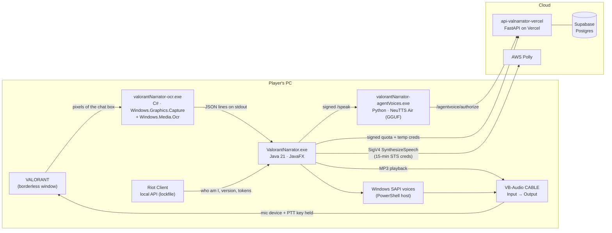

# Valorant Narrator — how it worked, version by version

Valorant Narrator turns Valorant **text chat into voice comms**. Someone types `rotate b` in team
chat, and a few hundred milliseconds later your teammates *hear* it in the agent voice you picked,
coming out of your mic on the team voice channel. No FPS hit, no extra hardware.

It started in August 2023 as a single JavaFX window that polled a localhost endpoint every 100 ms.
Three years and ~40 releases later it is a Java desktop app, a C# screen-OCR sidecar, a local
neural TTS server, a FastAPI backend on Vercel, a Supabase database, a payments service, and a
release pipeline. Almost every layer was rebuilt at least once — usually because something
upstream (Riot, Coqui, Speechify, Replit) changed under it.

This folder is the write-up of all of that.

> Everything here describes my own project. Endpoints, internal APIs and third-party behaviour are
> documented as they were *at the time*; most of it no longer works and none of it is an invitation
> to abuse anyone's service. Keys, account IDs, plan IDs and user data are deliberately left out.

---

## Read in this order

| # | Doc | What it covers |
|---|-----|----------------|
| 1 | [Version history](01-version-history.md) | Every major version from v1.3 (Aug 2023) to v4.39 (Jul 2026), what changed and *why* |
| 2 | [Reading the chat](02-reading-the-chat.md) | Five generations of chat capture: HTTP polling → local WebSocket → XMPP man-in-the-middle → a Java MITM that never shipped → screen OCR |
| 3 | [Voice & audio pipeline](03-voice-and-audio.md) | AWS Polly (SDK, then hand-signed SigV4 with STS creds), Windows SAPI voices, and the trickiest part: getting audio *into the game's mic* (Robot PTT, VB-Cable, rewriting Valorant's cloud keybinds, playback detection) |
| 4 | [Agent voices & voice cloning](04-agent-voices-and-cloning.md) | How the agent voices were made: Coqui Studio → Speechify → local XTTS-v2 → local NeuTTS Air. Datasets, speaker latents, reference codes, and the server-side auth gate |
| 5 | [Backend](05-backend.md) | Replit → self-hosted Quart → Vercel FastAPI + Supabase. Endpoints, schema, quotas, temporary AWS credentials, payments (PayPal, Razorpay), referrals, auto-updates and the release pipeline |
| 6 | [The Speechify era](06-speechify-era.md) | Retrospective on the Feb 2024 – Nov 2025 agent-voice backend: what it was, why it was the wrong foundation, and the migration to a local model. Not a reproduction guide. |
| 7 | [How the Speechify-backed agent voices worked](07-speechify-workings.md) | Historical component map of voice preparation, the backend request path, app playback, and the move to local synthesis. |

---

## How it works today (v4.39, Jul 2026)

1. **Capture.** The OCR sidecar screenshots Valorant's chat box ~20 times a second, OCRs it, and
   prints each *new* line as JSON (`{"channel":"TEAM","name":"Bob","body":"rotate a"}`).
2. **Filter.** The Java app drops channels you disabled, ignored players, and your own messages
   (unless "self" is on), then expands short forms (`gg` → "good game", `mb` → "my bad"…).
3. **Synthesize.** Depending on the selected voice: Windows built-in voice (free), AWS Polly
   standard/neural (quota-limited; neural for premium), or an agent voice from the local NeuTTS
   server (premium, with a free character trial).
4. **Transmit.** The app's audio output is pinned to `CABLE Input`; Valorant's voice-capture
   device was set to `CABLE Output`; the app holds the team push-to-talk key exactly while audio
   is detected on the cable.

---

## Every project that made up Valorant Narrator

Dates are repo creation → last push (GitHub), or first → last local change for things that never
had a remote.

| Project | Visibility | Created → last activity | Stack | Purpose |
|---|---|---|---|---|
| **ValorantNarrator** | private | 2023-08-20 → 2026-07-18 | Java 21, JavaFX, Maven, JPMS | The desktop app itself. 136 commits, v1.3 → v4.39 |
| **valorantnarratorOPS** | public | 2024-03-06 → 2026-07-18 | — | Public mirror + GitHub Releases for v4.0.3 and later; README, security policy |
| **ValorantNarratorRELEASE** | public (archived) | 2023-10-01 → 2025-12-04 | — | Installer releases before v4.0.3 |
| **xmpp (Node/TS)** | in app repo | 2023-11-19 → 2024-10-28 | Node.js, TypeScript, `node:tls` | Riot config proxy + XMPP TLS MITM, later compiled to `valorantNarrator-xmpp.exe` |
| **valorantNarratorAPI** | private | 2024-01-11 | Python, Quart, Hypercorn, asyncpg, boto3 | Backend code from the Replit era: quotas, STS creds, Coqui-backed agent voices |
| **ValNarratorAPI** | private | 2024-08-09 | Python, Quart, Redis rate limiter, asyncpg | Self-hosted backend: request signatures, registration, referrals, Speechify agent voices |
| **ValNarratorSite** | private | 2024-08-09 | HTML/CSS | First landing page |
| **ValNarratorPayment** | private | 2024-08-09 | Python | PayPal subscription creation + webhooks |
| **SpeechifyVCAutomate** | private | 2024-08-09 → 2026-07-16 | Python, Selenium, BeautifulSoup, pydub | Scraped agent voice lines, uploaded them to Speechify as voice clones; later became the release tooling ("AgentsCode") |
| **whispercpp** | public | 2024-08-09 | C++ | whisper.cpp snapshot used for the Java (JNA) speech-to-text/dictation experiments |
| **api-valnarrator-vercel** | private | 2024-10-26 → 2026-07-18 | Python, FastAPI, Supabase, boto3 | Current backend on Vercel. 73 commits |
| **payment-valnarrator-vercel** | private | 2024-10-28 → 2025-11-27 | Python, Flask, PayPal, Razorpay | Checkout (PayPal for international, Razorpay for INR) + webhooks |
| **site-valnarrator-vercel** | public | 2024-10-26 → 2025-12-09 | Python, Flask templates | `valnarrator.vercel.app`: landing, download, ToS, privacy, referral page |
| **ValorantMatchStats** | public | 2025-01-11 → 2025-01-18 | HTML/JS, Python | Side project: match stats viewer on the same Riot API knowledge |
| **VoiceCloner** | public | 2025-12-04 → 2026-07-14 | Python, Coqui TTS (XTTS-v2), FastAPI, PyInstaller | Generic local voice-clone server; shipped as the v3.90–v4.3x agent voice exe |
| **valorantNarrator-ocr** | local only | 2026-06-04 → 2026-07-17 | C# .NET 9, WinRT capture + OCR | Screen-OCR chat sidecar, the only chat source since v4.10 |
| **AgentVoiceServer** | private | 2026-07-17 → 2026-07-18 | Python, NeuTTS Air (llama.cpp GGUF), NeuCodec ONNX | Current agent voice server with backend authorization gate |
| **release.ps1 + ValorantNarrator.iss** | local only | 2023 → 2026-07-18 | PowerShell, Inno Setup, jpackage/jlink | Builds the OCR exe, voice server, Java app-image and installer |

Older siblings that fed into it: **match-valo-scraper** (2022, private — first time poking Riot's
match APIs) and the Discord bots (**vithron**, **Aestron**) where most of the async-Python
backend habits came from.

---

## The Speechify era (Feb 2024 – Nov 2025)

Premium agent voices ran on Speechify's consumer voice-cloning product for ~21 months, between
Coqui shutting down and the move to local models. It's covered as a retrospective — what it was,
why it was the wrong foundation, what replaced it — in
[06-speechify-era.md](06-speechify-era.md).
